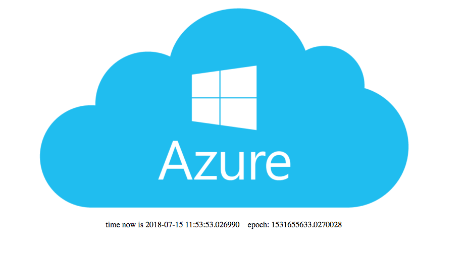

# azure-python-flask-postgresql

Simple web app with python, flask web framework, PostgreSQL.
Deployed to Azure PaaS services.


## What we'll do

1. Provision and Populate Azure Services
1. Configure Workstation
1. Develop the App
1. Dockerize the App
1. Deploy as a Docker image to Azure Container Instance
1. Deploy as a Docker image to Azure App Service
1. Deploy as a GitHub repo to a Data Science Virtual Machine (DSVM)
1. Deploy as a Docker image to a Data Science Virtual Machine (DSVM)

---

## 1. Provision and Populate Azure Services

### Provision an Azure Container Registry

See https://azure.microsoft.com/en-us/services/container-registry/

Once the registry has been created, view its settings in Azure Portal
and set the following environment variables on your system.
Example values are shown below:
```
AZURE_CONTAINER_REGISTRY_LOGIN_SERVER=cjoakimacr.azurecr.io
AZURE_CONTAINER_REGISTRY_NAME=cjoakimacr
AZURE_CONTAINER_REGISTRY_USER_NAME=cjoakimacr
AZURE_CONTAINER_REGISTRY_USER_PASS=<secret>
```

Also, you will probably want an account on DockerHub as well:
See https://hub.docker.com

### Provision and Populate Azure PostgreSQL

In the Azure Portal UI, provision a **Azure Database for PostgreSQL**

Once the database has been created, view its settings in Azure Portal
and set the following environment variables on your system.
Example values are shown below:
```
AZURE_PSQL_DB_NAME=olympics
AZURE_PSQL_DB_NAMESPACE=cjoakimpsql
AZURE_PSQL_DB_PASS=<secret>
AZURE_PSQL_DB_PORT=5432
AZURE_PSQL_DB_SERVER=cjoakimpsql.postgres.database.azure.com
AZURE_PSQL_DB_SERVER_ADMIN=cjoakim@cjoakimpsql
AZURE_PSQL_DB_SSLMODE=require
AZURE_PSQL_DB_USER=cjoakim
```

Also add a **Connection Security Rule** to allow access from any IP address.
Name the rule 'AllowAllIPs' with an IP range from 0.0.0.0 to 255.255.255.255 

To use these environment variables to connect to the Azure DB with
the **psql** client program, execute this script:
```
$ ./azure_psql.sh
```

To load the 'competitors' table of the 'olympics' Azure DB with the
**psql** client program, execute this script:
```
$ ./azure_load.sh
```

### Provision an Azure App Service with Docker

See section 6 below.

---

## 2. Configure Workstation

These instructions are for a Linux or macOS workstation.
Alternatively, you could use a remote Linux Data Science Virtual Machine (DSVM).

First, install the latest version of the Azure CLI (Command Line Interface).
See https://docs.microsoft.com/en-us/cli/azure/install-azure-cli?view=azure-cli-latest

Verify that you have the latest version of the CLI:
```
$ az --version
azure-cli (2.0.44)
...
```

You should see version 2.0.44 or later.

Then, execute some CLI commands:
```
$ az

     /\
    /  \    _____   _ _  ___ _
   / /\ \  |_  / | | | \'__/ _\
  / ____ \  / /| |_| | | |  __/
 /_/    \_\/___|\__,_|_|  \___|


Welcome to the cool new Azure CLI!
...

$ az login --help

$ az login
```

Next, download and install Docker Community Edition.
See https://www.docker.com/get-docker

Python 3.x and pip are assumed to be installed.

---

## 3. Develop the App

The application in this repository is a very simple Python3/Flask web application.
It is intended to simply demonstrate deployment to Azure.

---

## 4. Dockerize the App

See the **Dockerfile** which is used to create a **Docker Image** of this app.

Create an **Azure Container Registry** account in Azure Portal, and optionally
a **DockerHub** account at https://hub.docker.com.

See the **Dockerfile** and **build_image.sh**.
Notice how the Dockerfile does a **pip install** into the image.

```
$ docker build -t cjoakim/python-flask-postgresql . 

$ docker image ls | grep python-flask-postgresql
```

Test the Docker image locally on your workstation.  The -e parameter is used to
pass environment variables into the executed image.  The -p paramter maps port
5000 in the running image to port 5000 on your workstation.
```
$ docker run -d -e PORT=5000 -e AZURE_PSQL_DB_SERVER=$AZURE_PSQL_DB_SERVER -e AZURE_PSQL_DB_PORT=$AZURE_PSQL_DB_PORT -e AZURE_PSQL_DB_SERVER_ADMIN=$AZURE_PSQL_DB_SERVER_ADMIN -e AZURE_PSQL_DB_NAME=$AZURE_PSQL_DB_NAME -e AZURE_PSQL_DB_PASS=$AZURE_PSQL_DB_PASS -e AZURE_PSQL_DB_SSLMODE=$AZURE_PSQL_DB_SSLMODE -p 5000:5000 cjoakim/python-flask-postgresql:latest
```

Invoke the following URLs with your browser to verify that the app is working:
```
http://localhost:5000/
http://localhost:5000/env
http://localhost:5000/olympic_marathoners?year=1976&sex=m
http://localhost:3000/olympic_marathoners_json?year=1992&sex=f
```

Optionally "ssh" into the running image; first run a ps to get the CONTAINER ID:
```
$ docker ps
$ docker exec -it b23d3ce4b830 /bin/bash
@b23d3ce4b830:/app# curl -v http://localhost
@b23d3ce4b830:/app# curl -v http://localhost/env
exit
```

Stop the running image:
```
$ docker stop -t 2 b23d3ce4b830
```

Push the image to DockerHub after successfully testing it locally:
```
$ docker push cjoakim/python-flask-postgresql:latest
```

Push the image to Azure Container Registry:
```
$ az acr login --name cjoakimacr
$ az acr repository list --name cjoakimacr --output table

$ docker tag cjoakim/python-flask-postgresql:latest cjoakimacr.azurecr.io/python-flask-postgresql:latest
$ docker push cjoakimacr.azurecr.io/python-flask-postgresql:latest

$ az acr repository list --name cjoakimacr --output table
```

---

## 5. Deploy as a Docker image to Azure Container Instance (ACI)

The Azure CLI can be used to do this.

First create an Azure **resource group**:
```
$ az group create --location eastus --name FlaskFun

{
  "id": "/subscriptions/71......4f/resourceGroups/FlaskFun",
  "location": "eastus",
  "managedBy": null,
  "name": "FlaskFun",
  "properties": {
    "provisioningState": "Succeeded"
  },
  "tags": null
}
```

Then create the ACI in the new Resource Group:
```
$ az container create --resource-group FlaskFun --name "python-flask-postgresql27h" --image "cjoakimacr.azurecr.io/python-flask-postgresql:latest" --cpu 1 --memory 1 --registry-username "cjoakimacr" --registry-password "<secret>" --dns-name-label "python-flask-postgresql27h" --ports "80" --environment-variables 'PORT=80' 'AZURE_PSQL_DB_NAME=olympics' 'AZURE_PSQL_DB_NAMESPACE=cjoakimpsql' 'AZURE_PSQL_DB_PASS=big.DATA-18' 'AZURE_PSQL_DB_PORT=5432' 'AZURE_PSQL_DB_SERVER=cjoakimpsql.postgres.database.azure.com' 'AZURE_PSQL_DB_SERVER_ADMIN=cjoakim@cjoakimpsql' 'AZURE_PSQL_DB_SSLMODE=require' 'AZURE_PSQL_DB_USER=cjoakim'

$ az container list
```

That lengthy **az container create** command can be generated with main.py in this repo.  It reads and uses the several AZURE_xxx environment variables listed above:
```
$ python main.py gen_container_create_command <resource-group> <container-instance-name>
$ python main.py gen_container_create_command FlaskFun python-flask-postgresql27c
```

Invoke the running ACI with your browser:
- http://python-flask-postgresql27g.eastus.azurecontainer.io/
- http://python-flask-postgresql27g.eastus.azurecontainer.io/env
- http://python-flask-postgresql27g.eastus.azurecontainer.io/olympic_marathoners?year=1984&sex=f

See content similar to this:


---

## 6. Deploy as a Docker image to Azure App Service

In Azure Portal, create a **Web App** of type **Docker** and configure
it to use your image from Azure Container Registry as follows:


Visit the URL with your browser, for example:
http://python-flask-postgresql.eastus.azurecontainer.io:5000/

---

## 7. Deploy as a GitHub repo to a Data Science Virtual Machine

The DSVM contains many common pre-installed Data Science and Developer tools - 
python2, python3, R, git, docker, java, ant, maven, php, ruby, etc.

First, in Azure Portal, provision a **Data Science Virtual Machine for Linux (Ubuntu)**.  Specify your ssh keys.

Then, in the DSVM in Azure Porta, open up port 5000 for Flask via the 
Networking -> Add Inbound Port dialog.

ssh into the VM and execute the following commands:
```
$ git clone git@github.com:cjoakim/azure-python-flask-postgresql.git

$ ./venv.sh             <- creates the python virtual environment
$ source bin/activate   <- activate the virtual environment
$ python app.py         <- start the Flask web app
```

Then, visit the URL with your browser:
http://40.76.207.55:5000/

Note: this configuration and deployment process can be automated with **Ansible**.

### conda and Anaconda on the DSVM

Alternatively, you can use **conda**, since **Anaconda Python** is the default on the DSVM.

```
$ ./conda_env_dsvm.sh
$ source activate flaskweb
$ python --version
Python 3.5.2 :: Anaconda custom (64-bit)
$ python app.py
```

See https://www.anaconda.com

---

## 8. Deploy as a Docker image to a Data Science Virtual Machine (DSVM)

Since both the Azure CLI and Docker are installed on the DSVM, you can also execute
your Docker image, rather than the source code, on the DSVM.

```
$ az --help
$ docker --help

$ sudo docker run -d -e PORT=5000 -p 5000:5000 cjoakim/python-flask-postgresql:latest
$ sudo docker ps
$ sudo docker stop -t 1 6a4895321e9e
```

---

## 9. Deploy to Azure App Service from GitHub

See https://docs.microsoft.com/en-us/visualstudio/python/publishing-python-web-applications-to-azure-from-visual-studio?view=vs-2017

---

## Links

- https://azure.microsoft.com/en-us/develop/python/
- https://docs.microsoft.com/en-us/azure/app-service/app-service-web-get-started-python
- https://docs.microsoft.com/en-us/azure/app-service/app-service-web-tutorial-python-postgresql 
- https://docs.microsoft.com/en-us/azure/app-service/web-sites-python-configure
- https://docs.microsoft.com/en-us/cli/azure/?view=azure-cli-latest
- git clone https://github.com/Azure-Samples/flask-postgresql-app
- https://www.anaconda.com
